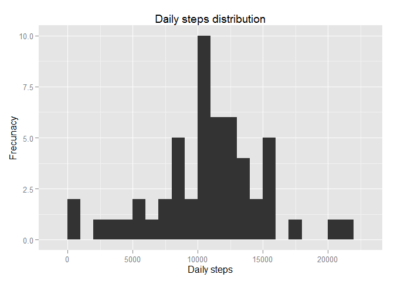
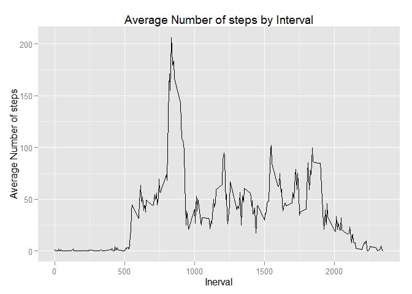
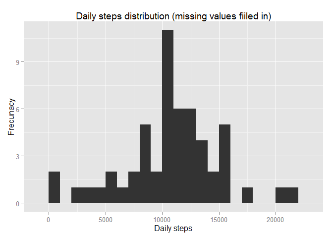
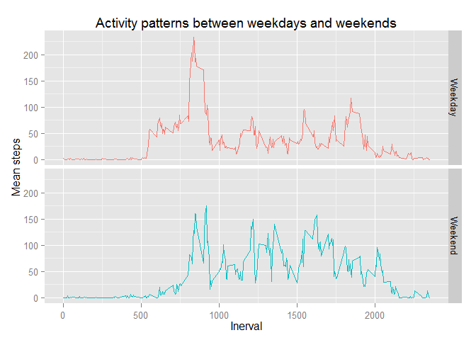

# Reproducible Research: Peer Assessment 1
Maria Loghin  
December, 2016  


##About

This is the first assignment for Coursera Reproducible Research course, part of Data Science specialization (by Johns Hopkins University). 


##Synopsis

The purpose of the project is to make use of the R Markdown language to publish the analyses answering a series of questions related to a collection of data about personal movement using an activity monitoring device.
The following steps will be performed to interpret this data and to the answer research questions:

- Loading the dataset and/or processing the data
- What is the mean total number of steps taken per day?
- What is the average daily activity pattern?
- Imputing missing values
- Differences in activity patterns between weekdays and weekends

##Data
The monitoring device collects data at 5 minute intervals throughout the day. The data consists of two months of data from an anonymous individual collected during the months of October and November, 2012 and include the number of steps taken in 5 minute intervals each day.

The data for this assignment can be downloaded from the GitHub repository forked from here [GitHub repository created for this assignment](http://github.com/rdpeng/RepData_PeerAssessment1).

- Dataset: [Activity monitoring data](https://github.com/rdpeng/RepData_PeerAssessment1/blob/master/activity.zip)


##Reproducible Research

### 1. Reading in the dataset and/or processing the data


The dataset is stored in a comma-separated-value (CSV) file. Read the file into data dataframe structure.


```r
# read file into data dataframe structure
file<-"./activity.csv"
temp<-"./activity.zip"
unzip(temp)
data <- read.csv(file, header = TRUE, sep=",")
```


Explore dataset:


```r
str(data)
```

```
## 'data.frame':	17568 obs. of  3 variables:
##  $ steps   : int  NA NA NA NA NA NA NA NA NA NA ...
##  $ date    : Factor w/ 61 levels "2012-10-01","2012-10-02",..: 1 1 1 1 1 1 1 1 1 1 ...
##  $ interval: int  0 5 10 15 20 25 30 35 40 45 ...
```

```r
# transform the "date" variable from factor data type to date data type
data$date <- as.Date(data$date , format = "%Y-%m-%d")
```

Dataset contains a total of 17,568 observations.
The variables included in this dataset are:

- steps: Number of steps taking in a 5-minute interval (missing values are coded as NA)
- date: The date on which the measurement was taken (we transformed this variable from factor data type to date data type in YYYY-MM-DD format)
- interval: Identifier for the 5-minute interval in which measurement was taken


### 2. What is the mean total number of steps taken per day?


```r
## load required libraries for ddply and ggplot functions
require(plyr)
require(ggplot2)

# Set the R options to print numeric values
options(scipen=999, digits=2)
```

Summarize the steps taken each day

- ignore the missing values in the dataset for "steps"" variable (as per assignment instructions) 


```r
DailyStepsSumm <- ddply(subset(data, (!is.na(data$steps))), .(date), summarise, steps = sum(steps))
```

Create the histogram of the total number of steps taken each day


```r
ggplot(data=DailyStepsSumm, aes(steps)) +
  geom_histogram(binwidth = 1000) +
  xlab("Daily steps") + 
  ylab("Frecunacy") + 
  ggtitle("Daily steps distribution")
```

 

Calculate mean and median of steps taken per day


```r
meanSteps <- mean(DailyStepsSumm$steps)
medianSteps <- median(DailyStepsSumm$steps)
```

The `mean` is **10766.19** and the `median` is **10765**.


### 3. What is the average daily activity pattern?

Calculate the average number of steps taken on the 5-minute interval, across all days

- ignore the missing values in the dataset for "steps"" variable 


```r
MeanByInterval <- ddply(subset(data, (!is.na(data$steps))), .(interval), summarise, meansteps = mean(steps))
```

Create the "Average Number of steps by Interval" plot


```r
ggplot(data = MeanByInterval, aes(x=interval, y=meansteps)) +
  geom_line(binwidth = 1000) +
  xlab("Inerval") + 
  ylab("Average Number of steps") + 
  ggtitle("Average Number of steps by Interval")
```

 

Get the 5-minute interval, on average across all the days, which contains the maximum number of steps


```r
int_max_steps <- subset(MeanByInterval, MeanByInterval$meansteps == max(MeanByInterval$meansteps))$interval
```

The 5-minute interval containing the maximum number of steps is **835**.


### 4. Imputing missing values

The presence of missing values may introduce bias into some calculations or summaries of the data. 
In the dataset exploration forward step we noted there are missing values for "steps" variable for a number of days/intervals.


```r
countNA <- sum(!complete.cases(data))
```

The total number of missing values in the dataset (the total number of rows with NAs) is **2304**.

The missing values need to be filled in. We will impute the missing values for the "steps" variable using the calculation of the number of steps by 5-minute interval averaged across all days.  


```r
MeanByInterval <- ddply(subset(data, (!is.na(data$steps))), .(interval), summarise, meansteps = mean(steps, na.rm = TRUE))

data$steps[is.na(data$steps)] <- subset(MeanByInterval, MeanByInterval$interval == data$interval[is.na(data$steps)])$meansteps
```

Recalculate the total number of steps taken each day and recreate the histogram


```r
DailyStepsSummNA <- ddply(subset(data, (!is.na(data$steps))), .(date), summarise, steps = sum(steps))

ggplot(data=DailyStepsSummNA, aes(steps)) +
  geom_histogram(binwidth = 1000) +
  xlab("Daily steps") + 
  ylab("Frecunacy") + 
  ggtitle("Daily steps distribution (missing values fiiled in)")
```

 

Recalculate the mean and the median of total number of steps taken per day


```r
meanStepsNA <- mean(DailyStepsSummNA$steps)
medianStepsNA <- median(DailyStepsSummNA$steps)

meanDiff <- meanStepsNA - meanSteps
medianDiff <- medianStepsNA - medianSteps


sumStepsNA <- sum(DailyStepsSummNA$steps)
sumSteps <- sum(DailyStepsSumm$steps)
diffTotalSteps = sumStepsNA - sumSteps
```


For the dataset with the missing values filled in:

 - the `mean` is **10766.19** 
 - the `median` is **10765.59**.
 
 Compared to the original dataset:
 
- the `mean` deffer of **0**
- the `median` deffer of **0.59**

The difference for the total daily number of steps between the dataset imputed and the original dataset

- **10766.19**


### 5. Differences in activity patterns between weekdays and weekends


**Create a new variable indicating whether a given date is a weekday or weekend day**


```r
data$weekday <- ifelse(weekdays(data$date) %in% c("Sunday","Saturday"),"Weekend", "Weekday") 
```

Calculate the average number of steps taken, averaged across all weekday days or weekend days


```r
MeanIntervalWday <- ddply(data, .(interval, weekday), summarise, meansteps = mean(steps, na.rm = TRUE))
```

Plot activity patterns between weekdays and weekends


```r
ggplot(data = MeanIntervalWday, aes(x=interval, y=meansteps)) +
  geom_line(aes(colour = weekday)) +
  xlab("Inerval") + 
  ylab("Mean steps") + 
  ggtitle("Activity patterns between weekdays and weekends") +
  facet_grid(weekday ~ .) +
  theme(legend.position="none")
```

 


